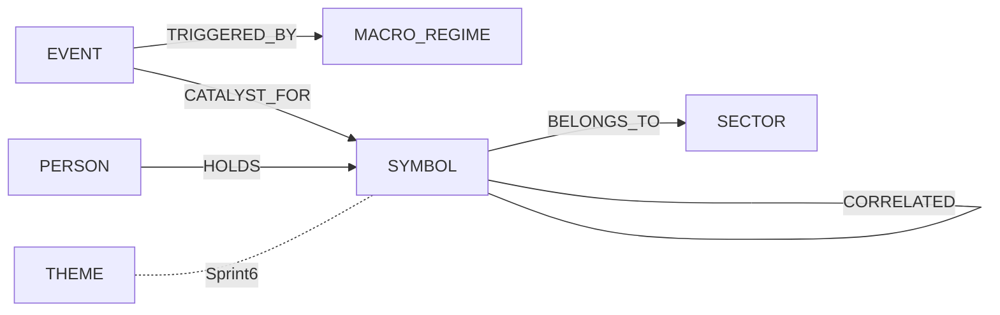

# GothamGraph v1 Design Specification

> Luxon Terminal Sprint 5 Phase 2 — Entity Ontology Graph
> 작성일: 2026-04-11 / 대상 스프린트: Sprint 5 / 의존: Phase 1 (Sprint 1-4) 재료
> 상태: Draft → 승인 대기 → 구현 착수 전 계약서

---

## 0. 한 줄 요약

Palantir Gotham식 엔티티 온톨로지 그래프를 Luxon Terminal에 얇게 이식 — Phase 1의 산출물(MacroRegime, OrderProposal)을 구조화된 노드/엣지로 변환해 3-hop 쿼리와 추론 기반 구축.

---

## 1. 배경 & 동기

- Phase 1 재료 준비 100% 완료 (Sprint 1-4). FRED / TickVault / MacroRegime / Phase1Pipeline / ConvictionBridge 가 데이터 + 신호를 만든다.
- 이대로 스트리밍만 하면 "지금 이 순간" 만 있음. 그래프가 있어야 "NVDA 샀을 때 regime이 뭐였지?", "이 섹터에서 가장 많이 fire된 catalyst는?" 같은 질의가 가능.
- Palantir Gotham 이 엔티티-관계-시간축 3차원을 단일 온톨로지로 푼 방식을 차용. 수사 / 금융 / 물류 같은 이질적인 도메인을 한 그래프 언어로 다루는 것이 핵심.
- 단, Neo4j 서버 배포는 과도함 → Sprint 5는 **순수 Python stdlib (dict + list)** 로 시작, Neo4j 백엔드는 Sprint 6-8 옵션. TickVault 가 pickle 로 안착한 경험 (Sprint 3) 과 같은 패턴.

### 1.1 Phase 1 에서 넘어오는 재료

| 출처 | 산출물 | GothamGraph 에서의 역할 |
|---|---|---|
| `luxon_terminal.macro.regime.MacroRegimeDashboard` | `MacroRegimeResult` | `MACRO_REGIME` 노드 |
| `luxon_terminal.phase1.pipeline.Phase1Pipeline` | `Phase1CheckpointResult` | ingest 트리거 |
| `luxon_terminal.trading.order.OrderProposal` | `OrderProposal` dataclass | `SYMBOL` + `EVENT` + `CATALYST_FOR` |
| `luxon_terminal.phase1.conviction_bridge.ConvictionBridge` | gate 결과 / conviction | `EVENT.payload` 에 포함 |

### 1.2 기대 효과

1. **히스토리 쿼리**: "직전 recovery regime 동안 BUY 결정된 symbol 전부" → 2-hop 호출로 끝.
2. **섹터 클러스터링**: BELONGS_TO 엣지로 포지션이 섹터별로 자동 분산된 것을 볼 수 있다.
3. **카탈리스트 추론**: EVENT 노드의 `passed_gates` 로 어떤 gate 조합이 가장 많은 fire 를 만들었는지 집계 가능.
4. **Sprint 6+ UI**: 직렬화 가능한 구조이므로 HTML 프론트엔드에서 3-hop 브라우저를 띄울 수 있다.

---

## 2. Scope (Sprint 5 MVP)

### 2.1 In Scope

- **6 노드 타입**: `SYMBOL`, `SECTOR`, `EVENT`, `THEME`, `MACRO_REGIME`, `PERSON`
- **5 엣지 타입**: `BELONGS_TO`, `CATALYST_FOR`, `HOLDS`, `CORRELATED`, `TRIGGERED_BY`
- **GothamGraph 코어**: CRUD, `neighbors(in/out/both + kind filter)`, `three_hop` 경로, `nodes_by_kind` / `edges_by_kind`
- **Phase1Ingestor**: `Phase1CheckpointResult` → MacroRegime 노드, `OrderProposal` → Symbol + Event + edges
- **pickle 직렬화**: TickVault 와 동일 방식. 스키마 안정 후 JSON 교체 고려.
- **18+ 단위 테스트**: Graph CRUD / Query / three_hop / Serialization / Ingestor 분리

### 2.2 Out of Scope (Sprint 6+)

- Neo4j 백엔드 (현재 stdlib 으로 충분, 노드 수 10^4 이하 가정)
- HTML 인터랙티브 시각화 (Sprint 6 별도 계약서)
- `cufa_ingestor` / `dart_ingestor` / `news_ingestor` (Sprint 6)
- `CatalystTracker` 통합 (Sprint 6 — 기존 `catalyst_tracker.py` 재사용)
- `factor_to_views` 다리 (Sprint 12 Factor Zoo)
- 시계열 인덱싱 / 시간 범위 쿼리 — Sprint 5 는 linear scan

### 2.3 Non-Goals

- "Neo4j 가 해결하는 모든 문제를 stdlib 로" 가 아님. Phase 1 산출물 구조화 저장 + 3-hop 까지만.
- 쿼리 언어 (Cypher, GraphQL) 없음. Python 함수 호출만. 단일 프로세스 in-memory + pickle.

---

## 3. 노드 카탈로그 (6종)

### 3.1 SYMBOL — 종목

| 필드 | 설명 |
|---|---|
| kind | `NodeKind.SYMBOL` (`"symbol"`) |
| 예시 | `symbol:005930` (삼성전자), `symbol:NVDA`, `symbol:BTC-USD` |
| 출처 | `Phase1Ingestor.ingest_proposal()` + 장래 Phase 4 execution/fill |
| payload | `{"symbol": str}` |

동일 symbol 이 여러 번 ingest 되어도 노드는 1개만 (멱등). `OrderProposal.symbol` 이 그대로 키.

### 3.2 SECTOR — 섹터 (KRX 분류)

| 필드 | 설명 |
|---|---|
| kind | `NodeKind.SECTOR` (`"sector"`) |
| 예시 | `sector:반도체`, `sector:이차전지` |
| 출처 | `Phase1Ingestor.ingest_proposal(sector=...)` + 장래 CUFA ingestor |
| payload | `{"name": str, "krx_code": str | None}` |

KRX 업종분류 기본. 테마/컨셉 섞일 수 있음 (Sprint 6 정규화 고민). Sprint 5 는 ingest 호출자가 문자열 그대로 넘김.

### 3.3 EVENT — 사건

| 필드 | 설명 |
|---|---|
| kind | `NodeKind.EVENT` (`"event"`) |
| 예시 | `event:005930:BUY:2026-04-11T19:40:00` |
| 출처 | `Phase1Ingestor.ingest_proposal()` + 장래 DART/News ingestor |
| payload | `{"action": str, "symbol": str, "position_pct": float, "conviction": float, "reason": str, "passed_gates": list[str]}` |

Gotham 에서 EVENT 는 가장 풍부. 거래 / 뉴스 / DART / 카탈리스트 fire 가 모두 EVENT 의 서브타입. Sprint 5 는 "conviction 계산 끝난 OrderProposal" 이 EVENT. 같은 symbol 에 여러 EVENT 가 시계열 축적.

### 3.4 THEME — 테마

| 필드 | 설명 |
|---|---|
| kind | `NodeKind.THEME` (`"theme"`) |
| 예시 | `theme:AI`, `theme:우주`, `theme:탄소중립` |
| 출처 | 장래 CUFA / news ingestor (Sprint 5 는 수동 추가만) |
| payload | `{"name": str, "description": str}` |

섹터보다 상위 또는 횡단 개념. "AI" 는 반도체 / SW / 로봇 섹터에 걸침. Sprint 5 는 자동 ingest 경로 없음, 테스트에서 수동 `add_node`.

### 3.5 MACRO_REGIME — 매크로 레짐

| 필드 | 설명 |
|---|---|
| kind | `NodeKind.MACRO_REGIME` (`"macro_regime"`) |
| 예시 | `macro_regime:recovery:2026-04-11T19:40:02` |
| 출처 | `Phase1Ingestor.ingest_checkpoint()` |
| payload | `{"regime": str, "confidence": float, "score": float, "positive_signals": int, "negative_signals": int, "neutral_signals": int, "allocation": dict, "macro_indicator_count": int, "fred_series_loaded": int}` |

`MacroRegimeResult` 을 그대로 flatten. 체크포인트마다 신규 노드가 생성되므로 시계열 스냅샷 역할 (동일 `regime` 이라도 타임스탬프 다르면 별개 노드).

### 3.6 PERSON — 인물

| 필드 | 설명 |
|---|---|
| kind | `NodeKind.PERSON` (`"person"`) |
| 예시 | `person:이재용`, `person:Bill Ackman` |
| 출처 | 장래 CUFA 보고서 인물 추출 (Sprint 6) |
| payload | `{"name": str, "role": str, "organization": str}` |

투자자 / 경영자 / 애널리스트를 구분 없이 담음. Sprint 5 는 Ingestor 없음, 수동 추가만.

---

## 4. 엣지 카탈로그 (5종)

| 엣지 | 방향 | 예시 | 의미 | weight |
|---|---|---|---|---|
| `BELONGS_TO` | symbol → sector | `symbol:005930` → `sector:반도체` | 소속 | 1.0 고정 |
| `CATALYST_FOR` | event → symbol | `event:...` → `symbol:005930` | 이벤트가 종목의 catalyst | `position_pct` |
| `HOLDS` | person → symbol | `person:이재용` → `symbol:005930` | 지분 보유 | 보유 비중 (0-1) |
| `CORRELATED` | symbol ↔ symbol | `symbol:005930` ↔ `symbol:000660` | 상관관계 | `|rho|` (0-1) |
| `TRIGGERED_BY` | event → macro_regime | `event:...` → `macro_regime:crisis` | regime 이 event 트리거 | 1.0 고정 |

### 4.1 방향성 주의

- `BELONGS_TO`, `CATALYST_FOR`, `HOLDS`, `TRIGGERED_BY` 는 **단방향**. source→target 만 저장.
- `CORRELATED` 는 **양방향**. 내부적으로 두 directed edge 로 저장 + 중복 제거.
- `neighbors(direction="in")` 을 위해 adjacency list 는 정방향 + 역방향 두 개 유지.

### 4.2 Mermaid 관계도



---

## 5. 공용 계약서 (코드 API)

### 5.1 nodes.py / edges.py

```python
class NodeKind(str, Enum):
    SYMBOL = "symbol"; SECTOR = "sector"; EVENT = "event"
    THEME = "theme"; MACRO_REGIME = "macro_regime"; PERSON = "person"


@dataclass(frozen=True)
class GraphNode:
    node_id: str
    kind: NodeKind
    label: str
    timestamp: datetime
    payload: dict[str, Any] = field(default_factory=dict)


def make_node_id(kind: NodeKind, key: str) -> str:
    return f"{kind.value}:{key}"


class EdgeKind(str, Enum):
    BELONGS_TO = "belongs_to"; CATALYST_FOR = "catalyst_for"
    HOLDS = "holds"; CORRELATED = "correlated"; TRIGGERED_BY = "triggered_by"


@dataclass(frozen=True)
class GraphEdge:
    source_id: str
    target_id: str
    kind: EdgeKind
    weight: float = 1.0
    timestamp: datetime | None = None
    meta: dict[str, Any] = field(default_factory=dict)
```

### 5.2 graph.py

```python
from typing import Literal
Direction = Literal["out", "in", "both"]


class GothamGraph:
    """Entity ontology graph — stdlib only, pickle-backed."""

    def __init__(self) -> None: ...
    def add_node(self, node: GraphNode) -> None         # 중복 ValueError
    def add_edge(self, edge: GraphEdge) -> None         # 엔드포인트 미존재 ValueError
    def get_node(self, node_id: str) -> GraphNode | None
    def has_node(self, node_id: str) -> bool
    def has_edge(self, src: str, tgt: str, kind: EdgeKind | None = None) -> bool
    def remove_node(self, node_id: str) -> bool         # 인접 엣지 함께 제거
    def nodes_by_kind(self, kind: NodeKind) -> list[GraphNode]
    def edges_by_kind(self, kind: EdgeKind) -> list[GraphEdge]

    def neighbors(
        self,
        node_id: str,
        edge_kind: EdgeKind | None = None,
        direction: Direction = "out",
    ) -> list[GraphNode]:
        """
        direction:
          - "out"  → source 가 나인 엣지를 따라 target 수집
          - "in"   → target 이 나인 엣지를 따라 source 수집
          - "both" → 합집합 (중복 제거)
        edge_kind 필터는 옵션.
        """

    def three_hop(
        self,
        start_id: str,
        kinds_path: tuple[EdgeKind, ...],
    ) -> list[list[GraphNode]]:
        """
        kinds_path 길이만큼 hop. 각 경로는 start 부터 시작하는 노드 시퀀스.
        Sprint 5 는 hop 당 direction 을 "out" 으로 고정.
        혼합 방향은 neighbors() 를 체인해서 조립.
        """

    def save(self, path: Path) -> None                  # pickle
    @classmethod
    def load(cls, path: Path) -> "GothamGraph"

    @property
    def node_count(self) -> int
    @property
    def edge_count(self) -> int
    def __len__(self) -> int
```

---

## 6. Phase1Ingestor 계약

### 6.1 ingest_checkpoint(result) -> str | None

1. `result.regime_result` 가 `None` 이면 즉시 `None` 반환.
2. `node_id = make_node_id(MACRO_REGIME, f"{regime}:{timestamp.isoformat()}")`
3. payload 는 3.5 스키마대로 flatten. `allocation` 은 dict 그대로.
4. `graph.add_node(...)` 호출 후 `node_id` 반환.

### 6.2 ingest_proposal(proposal, *, sector=None, regime_node_id=None) -> tuple[str, str]

1. `symbol_id = make_node_id(SYMBOL, proposal.symbol)`. 없으면 `SymbolNode` 추가, 있으면 skip (멱등).
2. `event_id = make_node_id(EVENT, f"{symbol}:{action}:{ts.isoformat()}")`. **항상 신규 추가** — 같은 symbol 여러 체결은 각기 별개 사건.
3. `CATALYST_FOR` 엣지: `event → symbol`, `weight = proposal.position_pct`.
4. `sector` 가 주어지면: 섹터 노드 추가 + `BELONGS_TO` 엣지 `symbol → sector` (중복 skip).
5. `regime_node_id` 가 주어지면: `TRIGGERED_BY` 엣지 `event → macro_regime` (weight=1.0).
6. 반환: `(symbol_id, event_id)`.

---

## 7. 3-hop 쿼리 설계

### 7.1 왜 3-hop 인가

금융 도메인의 의미 있는 질의는 대부분 2-3 hop 안. "종목을 갖고 있는 사람이 또 무엇을 보유" = 2 hop. "섹터의 종목들의 최근 이벤트 중 recovery regime 에서 발생" = 3 hop. 4+ hop 은 추론 품질 급락 + 계산량 폭발.

### 7.2 kinds_path 튜플

`three_hop(start, kinds_path=(K1, K2))`:

1. `start` 노드에서 시작
2. `edge_kind=K1` 아웃-엣지로 이웃 수집 → 1st hop
3. 각 1st hop 에서 `edge_kind=K2` 아웃-엣지로 이웃 수집 → 2nd hop
4. 반환: `[[start, hop1, hop2], ...]`

튜플 길이 N → hop 수 N, 경로 노드 수 N+1.

### 7.3 시나리오 A: "RECOVERY regime 에서 trigger 된 이벤트로 사간 종목들"

- start: `macro_regime:recovery:...`
- `TRIGGERED_BY` 는 event→regime 이므로 regime 에서 보면 **in-edge**. `three_hop` 단방향으론 불가 → 두 단계 조립:

```python
events = graph.neighbors(regime_id, EdgeKind.TRIGGERED_BY, "in")
symbols = []
for ev in events:
    symbols.extend(graph.neighbors(ev.node_id, EdgeKind.CATALYST_FOR, "out"))
```

### 7.4 시나리오 B: "삼성전자를 홀딩하는 인물들이 보유하는 다른 종목들"

```python
holders = graph.neighbors("symbol:005930", EdgeKind.HOLDS, "in")
other = []
for person in holders:
    other.extend(graph.neighbors(person.node_id, EdgeKind.HOLDS, "out"))
# 시작 symbol 제외는 호출자 책임
```

### 7.5 시나리오 C: "반도체 섹터 종목들의 최근 이벤트들"

```python
symbols = graph.neighbors("sector:반도체", EdgeKind.BELONGS_TO, "in")
events = []
for sy in symbols:
    events.extend(graph.neighbors(sy.node_id, EdgeKind.CATALYST_FOR, "in"))
```

### 7.6 결론: three_hop() 의 스코프

- Sprint 5 `three_hop(start, kinds_path)` 는 **단순 out-direction 경로 탐색만** 지원.
- 혼합 방향은 호출자가 `neighbors()` 체인으로 조립.
- Sprint 6 에서 `kinds_path: tuple[tuple[EdgeKind, Direction], ...]` 로 확장 여지.

---

## 8. 직렬화 (pickle)

- **이유**: TickVault (Sprint 3) 의 pickle 패턴을 그대로 따른다. 스키마가 유동적이라 JSON 을 짜는 비용이 더 크다. Sprint 6-8 에서 JSON / MessagePack 으로 교체 고려.
- **저장 대상**: `self._nodes` dict + `self._edges` list **만**. adjacency cache (`_out_adj`, `_in_adj`) 는 저장 X — load 후 재구축.
- **파일 확장자**: `.gotham.pkl` 권장 (TickVault `.tick.pkl` 과 네이밍 일관).
- **경로 예시**: `backtester/data/gotham/2026-04-11_phase1.gotham.pkl`
- **load**: classmethod `GothamGraph.load(path)` → 새 인스턴스 반환.
- **스키마 버전**: Sprint 5 는 key 없이 `{"nodes": ..., "edges": ...}` pickle. Sprint 6+ 에서 `version` 키 추가 + 분기.

---

## 9. 금기 (하지 말 것)

- ❌ `networkx` / `neo4py` / `py2neo` 의존 추가 — **stdlib only**
- ❌ `luxon_terminal/execution/`, `providers/kis`, `providers/upbit` 수정 금지
- ❌ `phase1/pipeline.py` / `ConvictionSizer` / `ConvictionBridge` 내부 수정 (호출만)
- ❌ `macro/regime.py` / `FREDHub` / `TickVault` 수정 금지
- ❌ 미커밋 파편 4개 (`lean/executor`, `lean/project_manager`, `utils/korean_market`, `kis_mcp/tools/backtest`) 건드리지 말 것
- ❌ 실 주문 전송 — 본 스프린트는 분석/저장 계층
- ❌ 그래프 엔진 풀스택 (MVP 6 노드 / 5 엣지 + 3-hop 까지만)
- ❌ 자동 시각화 / HTML 출력 (Sprint 6)
- ❌ 다른 Ingestor 추가 (cufa/dart/news) (Sprint 6)

---

## 10. 테스트 전략

총 19 테스트. 2 파일 분리:

- `tests/test_gotham_graph.py` (13 tests)
- `tests/test_phase1_ingestor.py` (6 tests)

### 10.1 Graph CRUD (5 tests)

1. `test_add_node_ok` — 추가 후 `has_node` / `get_node`
2. `test_add_duplicate_node_raises` — 같은 node_id 두 번 → ValueError
3. `test_add_edge_ok` — 양 끝점 있는 엣지 추가
4. `test_add_edge_unknown_endpoint_raises` — endpoint 없으면 ValueError
5. `test_remove_node_removes_incident_edges` — 인접 엣지 모두 사라짐

### 10.2 Query (3 tests)

6. `test_nodes_by_kind` — SYMBOL 3 / SECTOR 1 후 kind 필터
7. `test_neighbors_out_direction` — out-edge 만
8. `test_neighbors_both_direction_dedup` — in+out 합집합 중복 제거

### 10.3 three_hop + Pickle (5 tests)

9. `test_three_hop_length_2` — 2-hop 경로 개수
10. `test_three_hop_no_path_returns_empty` — 경로 없음
11. `test_three_hop_respects_edge_kind_filter` — kind 차단
12. `test_save_and_load_roundtrip` — save/load 후 count 동일
13. `test_load_rebuilds_adjacency` — load 후 `neighbors()` 정상

### 10.4 Phase1Ingestor (6 tests)

14. `test_ingest_checkpoint_with_regime` — `MacroRegimeNode` payload 정확
15. `test_ingest_checkpoint_none_regime_returns_none` — `regime_result=None` → None
16. `test_ingest_checkpoint_payload_includes_all_fields` — confidence/signals/allocation 포함
17. `test_ingest_proposal_creates_symbol_and_event` — 두 노드 + CATALYST_FOR
18. `test_ingest_proposal_reuses_existing_symbol` — 같은 symbol 두 번 → Symbol 1, Event 2
19. `test_ingest_proposal_with_sector_and_regime` — BELONGS_TO + TRIGGERED_BY 생성

### 10.7 수용 기준

- pytest 19/19 green
- `pytest --cov=luxon_terminal.gotham` 85%+
- `mypy luxon_terminal/gotham/` 에러 0
- CI 의 기존 회귀 794 tests 모두 green 유지

---

## 11. 다음 단계 (Sprint 6 예고)

1. **HTML 인터랙티브 시각화** — d3.js / Cytoscape.js 로 3-hop 브라우저 (`docs/luxon/gotham_viewer.html`)
2. **cufa_ingestor 추가** — `cufa-equity-report` 산출물에서 `THEME` / `PERSON` / `EVENT(DART)` 자동 생성
3. **CatalystTracker → EventNode 브리지** — 기존 `catalyst_tracker.py` 의 CatalystEntry 를 EVENT 로 변환
4. **Neo4j 옵션 백엔드 조사** — 노드 수 10^4 초과 시 전환 비용 측정, Cypher 쿼리 샘플 준비
5. **3-hop 에서 direction 혼합 지원** — `kinds_path: tuple[tuple[EdgeKind, Direction], ...]` 확장
6. **factor_to_views 다리 (Sprint 12)** — Factor Zoo 가 생성한 factor 를 `THEME` 노드로 흡수

---

## 부록 A. 파일 구조

```
luxon_terminal/gotham/{__init__, nodes, edges, graph, phase1_ingestor}.py
luxon_terminal/tests/{test_gotham_graph, test_phase1_ingestor}.py
```

## 부록 B. 승인 체크리스트

- [ ] 6 노드 / 5 엣지 타입이 Phase 1 산출물로 100% 커버되는가?
- [ ] `three_hop()` 의 단방향 제약이 시나리오 A/B/C 를 통해 납득 가능한가?
- [ ] pickle 직렬화가 TickVault 와 일관되는가?
- [ ] 금기 9개를 위반하는 설계가 없는가?
- [ ] 테스트 19 개가 Sprint 5 MVP 범위를 충분히 검증하는가?
- [ ] Sprint 6 예고 6개 중 최소 3개가 본 설계 위에서 자연스럽게 추가 가능한가?

---

**작성자 노트:** Phase 1 재료 준비 완료 직후 (Sprint 4 / 794 tests green) 시점. Neo4j 같은 "정답" 을 급하게 들이지 않고 stdlib 으로 코어 로직을 검증한 뒤 교체하는 것이 Luxon Terminal 의 지속 패턴 (TickVault pickle → Parquet 검토) 과 동일. 그래프가 쌓이면 CUFA / catalyst tracker / execution 계층이 "지금 이 순간" 을 넘어 "시간을 가로지르는 추론" 을 하게 된다.
